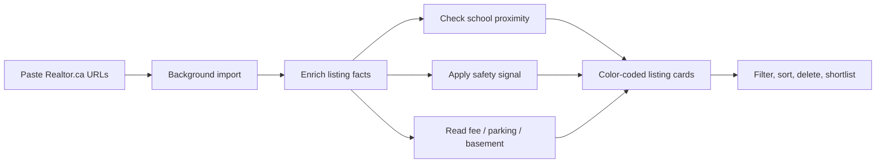
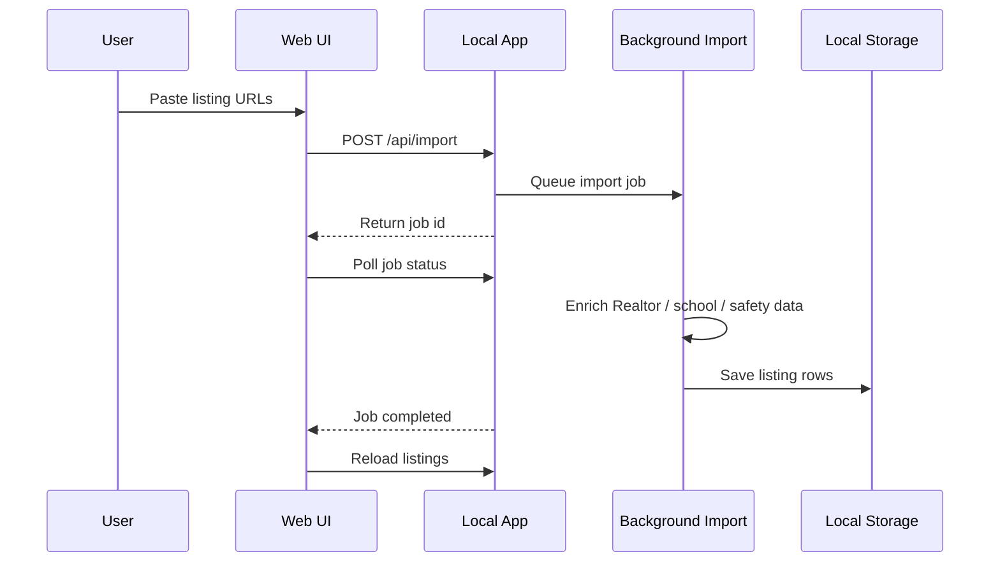
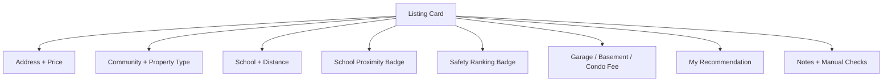
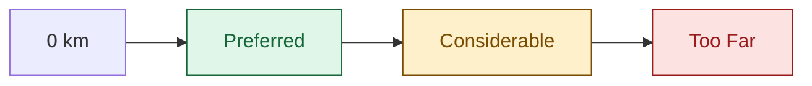
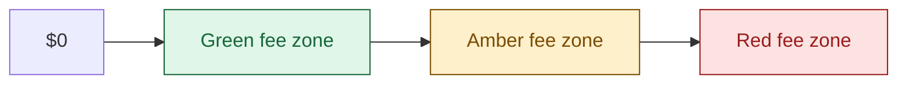
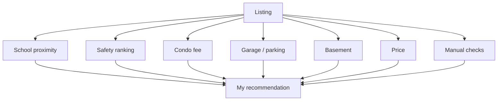
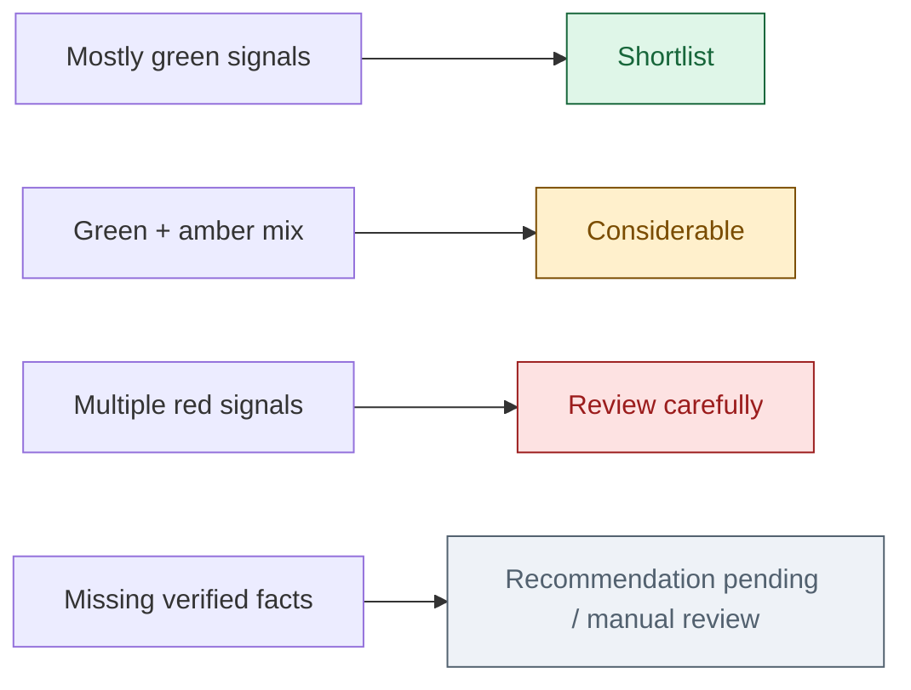
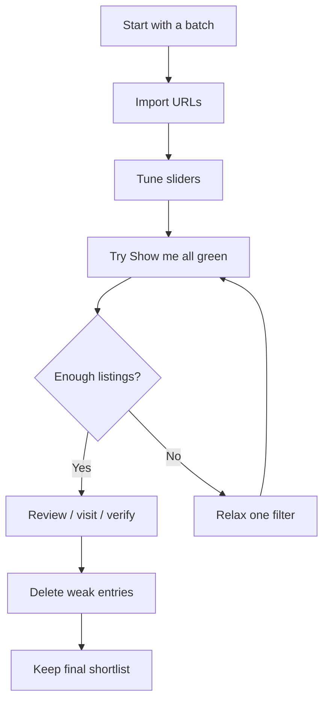

# Ottawa_Students_HomeHunter: A Smarter Way to Shortlist Ottawa Homes

Project name: **Ottawa_Students_HomeHunter**  
App name: **Ottawa Student's HomeHunter**

Finding a home is already a full-time emotional sport. Finding a home while also caring about school proximity, neighbourhood safety, condo fees, basement condition, parking, and resale sanity? That is where ordinary notes and browser tabs start sweating.

**Ottawa Student's HomeHunter** is a local web app built to make that hunt calmer, sharper, and a lot more repeatable. Paste Realtor.ca URLs, let the app enrich what it can, then compare properties using practical filters and color-coded signals that are easy to scan.

Made by a dad of two for fellow moms and dads.

It is not trying to be a generic real-estate portal. It is a decision cockpit for one specific mission:

> “Would I actually want my family living here, commuting to this school, paying this fee, parking this car, and trusting this neighbourhood?”

## What It Does

Ottawa_Students_HomeHunter helps shortlist Ottawa-area Realtor.ca listings using:

- School proximity
- Assigned OCDSB elementary school lookup
- Safety category
- Price
- Condo or maintenance fee
- Garage/parking quality
- Basement condition
- Recommendation labels
- Manual-verification flags

Each listing becomes a full-width card, designed for fast comparison instead of endless browser tabs.

## The Big Idea

Most home searches are noisy. A listing may look great until you discover the school is too far, the condo fee is painful, the parking is surface-only, or the area needs more safety review.

This app turns that fuzzy “hmm, maybe?” into visible signals:

- Green means strong
- Amber means acceptable or review-worthy
- Red means concern

You can tune some of these thresholds yourself, because “too far” and “too expensive” are personal.



## How To Run It

From the project folder:

```bash
./app_run_scripts/macos/start_app.sh
```

Then open:

```text
http://127.0.0.1:5001/
```

To stop the app:

```bash
./app_run_scripts/macos/stop_app.sh
```

Use `app_run_scripts/linux/` on Linux, or `app_run_scripts/windows/start_app.ps1` on Windows. The start script creates a local Python environment if needed, installs dependencies, and launches the app. You do not need to start a separate frontend server.

## Technical Details

The code architecture, project tree, data model, API map, and school-locator extension guide now live in:

```text
technical_documentation.md
```

## Walkthrough

The repository includes a 60-second GIF-style walkthrough at `screenshots/08-60-second-walkthrough.gif`. It uses abstracted UI frames so it is safe to share publicly and does not expose private listing details.

## Screenshots

The repository includes a small screenshot set under `screenshots/`:

- `01-home-dashboard.png`: loaded dashboard with summary tiles and controls
- `02-filter-panel.png`: expanded filter panel
- `03-proximity-slider.png`: school proximity threshold slider
- `04-condo-fee-slider.png`: condo fee color threshold slider
- `05-listing-cards-headers-blurred.png`: listing cards with only the header address/title text blurred
- `06-listing-card-detail-headers-blurred.png`: scrolled listing card view with only the header address/title text blurred
- `07-school-board-filter-dropdown.png`: school-board filter checkbox dropdown
- `08-60-second-walkthrough.gif`: one-minute GIF-style walkthrough for sharing the project

## How To Use It

### 1. Paste Realtor.ca URLs

Copy Realtor.ca listing URLs and paste them into the import box, one per line.

Then click:

```text
Import listings
```

The app starts a background import job. You can keep the page open while it works.

### 2. Let The Worker Enrich The Listings

The background worker attempts to enrich each listing with:

- Address and community from the Realtor.ca URL
- Realtor.ca facts where available
- Both OCDSB public and OCSB Catholic school-board lookup on every import
- School driving distance
- Safety category
- Condo fee, parking, basement, and recommendation data when known

If something cannot be verified, the listing is marked clearly instead of pretending.



### 3. Tune Your School Proximity

Click:

```text
Proximity slider
```

You get a two-handle slider:

- Green zone: Preferred
- Amber zone: Considerable
- Red zone: Too Far

Move the handles to define what those categories mean for you.

Example:

- Preferred up to 1.0 km
- Considerable up to 1.5 km
- Too Far after 1.5 km

The app recalculates school distance categories using your thresholds.

### 4. Tune Your Condo Fee Tolerance

Click:

```text
Condo fee slider
```

This also uses a two-handle slider:

- Green: comfortable fee
- Amber: acceptable but watch it
- Red: high fee

The fee colors update based on your own comfort level.

### 5. Filter Like A Human

Click:

```text
Filter
```

You can filter by:

- Safety
- School distance
- Basement
- Garage/parking
- Condo fee
- Recommendation
- Manual verification status
- Community
- Max price

There is also a shortcut:

```text
Show me all green
```

That shows only listings where the major signals are green.

### 6. Use The Summary Tiles

The summary numbers at the top are clickable:

- Listings: clears filters
- Preferred school distance: filters to preferred school distance
- Very safe: filters to very safe listings
- Need manual check: filters to listings requiring review

It is a quick way to move from overview to action.

### 7. Delete Entries

Each listing card has a red X in the top-right corner.

Hovering shows:

```text
Delete entry
```

Click it to remove that listing from the app.

## How The Listing Cards Work

Each card is intentionally wide, one per row, so you can scan without squinting.

You will see:

- Address and Realtor.ca link
- Price
- Community
- Property type
- Beds and baths
- Assigned school
- School distance
- School proximity label
- Safety ranking
- Garage/parking
- Basement
- Condo fee
- My recommendation
- Safety source notes
- Manual verification notes

The labels are deliberately explicit:

```text
School proximity: Preferred
Safety ranking: Very Safe
Garage: Underground parking
Basement: Finished
Condo fee: $455/mo
My recommendation: Review carefully
```

The point is to remove interpretation friction.



## The Color Rules

### School Proximity

Controlled by your proximity slider:

- Green: Preferred
- Amber: Considerable
- Red: Too Far



### Safety

- Green: Very Safe
- Amber: Moderate
- Red: Risky

### Condo Fee

Controlled by your condo fee slider:

- Green: low fee
- Amber: medium fee
- Red: high fee



### Basement

- Green: Finished
- Amber: Semi-finished or partly finished
- Red: Unfinished, no basement, or no information

### Garage/Parking

Green includes:

- Garage
- Underground
- Covered
- Carport
- Indoor
- Inside
- Enclosed
- Attached
- Detached

Red includes:

- No garage
- No parking
- None
- Pending

Anything else is amber.

### Recommendation

- Green: shortlist/recommend/good
- Amber: consider/maybe
- Red: pending or weak signal

## My Recommendation: What It Means

The **My recommendation** label is the app's practical summary of whether a listing deserves more attention.

It is not meant to replace judgment. It is meant to stop every property from feeling like a fresh debate.

Think of it as a quick triage label:

- **Shortlist**: worth keeping in the active search pile
- **Considerable**: not perfect, but still worth reviewing
- **Review carefully**: has enough friction that it needs a second look before spending more time
- **Recommendation pending**: not enough verified information yet

### The Factors Behind It

The recommendation is influenced by the same things a careful buyer keeps checking mentally:

- School proximity
- Safety ranking
- Condo or maintenance fee
- Garage/parking quality
- Basement condition
- Property price
- School reputation
- Manual verification flags



### How To Read It

If a listing is strong on the most important family-livability signals, it trends toward **Shortlist**.

Examples:

- Preferred school distance
- Very Safe safety ranking
- Manageable condo fee
- Finished basement
- Garage, underground, covered, or indoor parking
- No major manual-verification warning

If a listing has mixed signals, it trends toward **Considerable**.

Examples:

- School is a bit farther
- Safety is moderate but not risky
- Condo fee is amber
- Parking is usable but not ideal
- Basement is partly finished or unknown

If a listing has several concerns, it trends toward **Review carefully**.

Examples:

- School is too far
- Safety is risky
- Condo fee is red
- No garage or no parking
- Basement has no useful information
- Key facts need manual verification



### Important Note

In the current app, recommendation values can come from saved listing data or newly enriched listing signals. The app displays and color-codes them, and it uses the other live signals around them to help you decide whether the recommendation still feels right.

That means **My recommendation** should be treated as a smart shortlist cue, not a final verdict.

The strongest workflow is:

1. Use the recommendation to triage quickly.
2. Check the colored pills around it.
3. Open the source listing.
4. Manually verify any warning notes.
5. Decide whether it stays in your shortlist.

## Technical Details For Contributors

Implementation details, the database model, API routes, school locator internals, and extension instructions are kept in `technical_documentation.md`.

## Realtor.ca Data

The app attempts to fetch listing facts from Realtor.ca where possible.

However, Realtor.ca may block automated backend requests. When that happens, the app does not invent values. It keeps known saved values or marks missing facts for manual verification.

This is intentional. A wrong value is worse than a blank value when you are deciding where to live.

## Safety Logic

Safety is community-based and designed as a practical triage signal, not a substitute for final due diligence.

The app shows safety notes so you can see the reason/source context and decide what needs follow-up.

## Why This Is Useful

This app shines when you are comparing many “maybe” listings.

Instead of asking:

> “Which of these 47 tabs looked okay again?”

You can ask:

> “Show me safe listings, close to school, with acceptable fees and decent parking.”

That is a much better question.

## Suggested Workflow

1. Paste a batch of Realtor.ca URLs.
2. Import them.
3. Set your proximity slider.
4. Set your condo fee slider.
5. Click “Show me all green.”
6. Review the survivors.
7. Loosen one filter at a time if the list is too small.
8. Delete listings you are done with.
9. Keep the rest as your working shortlist.



## Practical Caveats

This app is a decision aid, not a legal, school-board, safety, or real-estate authority.

Before making an offer, verify:

- Current school assignment
- School boundary changes
- Condo status certificate
- Parking ownership/exclusive use
- Safety data
- Realtor.ca listing facts
- Fees and taxes

The app helps you decide what deserves that deeper verification.

## Design Choice: No Login

Ottawa_Students_HomeHunter intentionally skips login functionality.

That is a deliberate product choice, not a missing feature. The goal is to keep the app simple, personal, and local-first: paste URLs, enrich listings, compare options, and make a decision without account setup, passwords, roles, sessions, or user-management screens getting in the way.

If the app grows into a shared household or team workflow later, login can be added. For now, the best version of the tool is the one that starts quickly and stays focused on the home search.

## The Vibe

Ottawa_Students_HomeHunter is for the practical dreamer.

The person who wants the nice kitchen, yes, but also wants to know:

- Can my kid get to school without a daily logistics saga?
- Is the fee going to haunt me?
- Is parking going to be annoying every winter?
- Is this neighbourhood actually a fit?
- Is this a shortlist property or just a pretty distraction?

It brings the search back from chaos into comparison.

And sometimes, that is the difference between scrolling forever and making a confident decision.

## Credits

Created by:

- Soumyajit Datta
- GPT Codex

Built as a collaborative, iterative project: part home-search utility, part school-proximity assistant, part "let's make this messy decision easier to reason about."

Anyone is welcome to extend, adapt, or improve the project. As a courtesy, please provide credit to both creators: Soumyajit Datta and GPT Codex.
