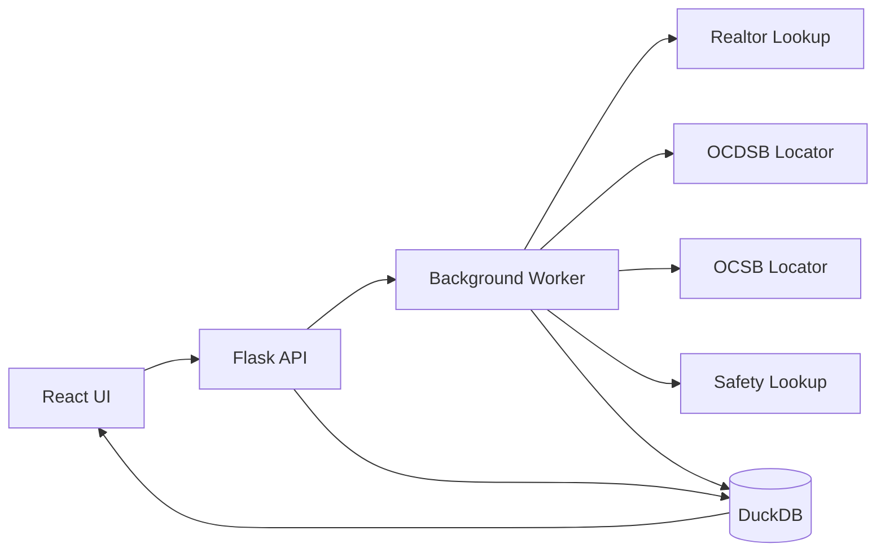
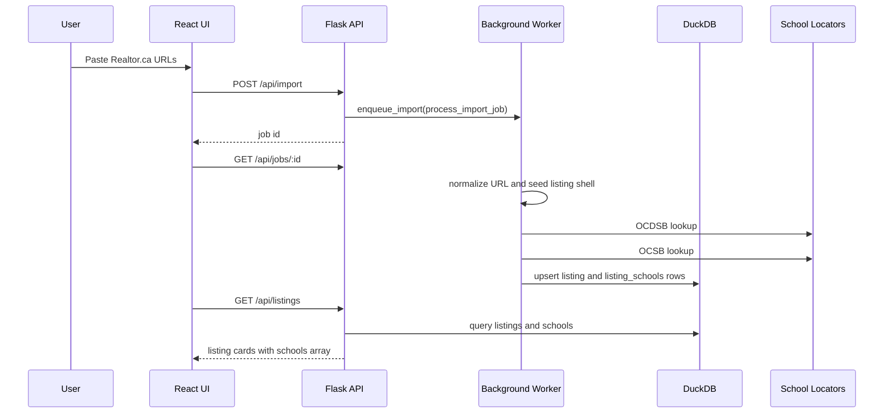
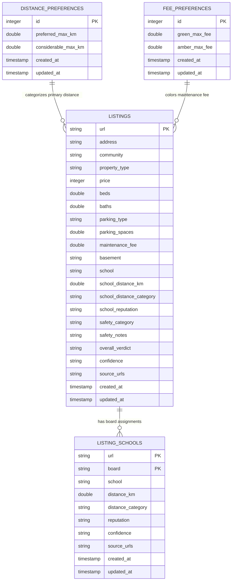

# Ottawa_Students_HomeHunter Technical Documentation

This file is the technical home for Ottawa_Students_HomeHunter. Product story, usage narrative, and audience-facing explanation live in `documentation.md`. First-time setup instructions live in `install.md`.

## System Overview

Ottawa_Students_HomeHunter is a local-first web app:

- **Frontend:** React served from `src/main/frontend` by Flask.
- **Backend:** Flask API in `src/main/backend/app.py`.
- **Storage:** local DuckDB database created at runtime.
- **Background work:** in-process worker queue for Realtor.ca, school, and safety enrichment.
- **School lookup:** per-board integrations with normalized results stored in `listing_schools`.



## Project Tree

```text
Ottawa_Students_HomeHunter/
├── .gitignore (Git ignore rules)
├── README.md (short project overview and links to deeper docs)
├── documentation.md (product/blog-style walkthrough and non-technical explanation)
├── install.md (novice-friendly setup instructions for macOS, Windows, and Linux)
├── technical_documentation.md (technical architecture, data model, extension guide, and project map)
├── requirements.txt (Python package versions used by the Flask backend and tests)
├── package.json (Node/Vite/React scripts and frontend package metadata)
├── package-lock.json (locked Node dependency graph for repeatable frontend installs)
├── vite.config.js (Vite configuration for optional frontend development)
├── app_run_scripts/ (platform-specific start/stop scripts)
│   ├── macos/
│   │   ├── start_app.sh (macOS bash script that prepares Python dependencies and starts Flask)
│   │   └── stop_app.sh (macOS bash script that stops the process listening on the app port)
│   ├── linux/
│   │   ├── start_app.sh (Linux bash script that prepares Python dependencies and starts Flask)
│   │   └── stop_app.sh (Linux bash script that stops the process listening on the app port)
│   └── windows/
│       ├── start_app.ps1 (Windows PowerShell script that prepares Python dependencies and starts Flask)
│       └── stop_app.ps1 (Windows PowerShell script that stops the process listening on the app port)
├── screenshots/ (repository screenshots safe to commit)
│   ├── 01-home-dashboard.png (dashboard screenshot with summary tiles and controls)
│   ├── 02-filter-panel.png (expanded filter panel screenshot)
│   ├── 03-proximity-slider.png (school proximity slider screenshot)
│   ├── 04-condo-fee-slider.png (condo fee slider screenshot)
│   ├── 05-listing-cards-headers-blurred.png (listing cards screenshot with header text blurred)
│   ├── 06-listing-card-detail-headers-blurred.png (listing detail screenshot with header text blurred)
│   ├── 07-school-board-filter-dropdown.png (school-board filter dropdown screenshot)
│   └── 08-60-second-walkthrough.gif (shareable GIF-style walkthrough with abstracted UI frames)
├── src/
│   ├── main/
│   │   ├── backend/
│   │   │   ├── app.py (Flask app, API routes, import orchestration, and frontend serving)
│   │   │   ├── background_worker.py (small in-process job queue for long-running imports)
│   │   │   ├── storage.py (DuckDB schema, migrations, listing persistence, preferences, and school rows)
│   │   │   ├── ocdsb_lookup.py (OCDSB public school locator integration and distance calculation)
│   │   │   ├── ocsb_lookup.py (OCSB Catholic BusPlanner locator integration and result parsing)
│   │   │   ├── realtor_lookup.py (Realtor/listing fact enrichment helpers)
│   │   │   └── safety_lookup.py (community safety categorization helpers)
│   │   └── frontend/
│   │       ├── index.html (single-page app shell loaded by Flask)
│   │       ├── src/
│   │       │   └── App.js (React UI, filters, cards, import flow, settings, and client-side behavior)
│   │       └── styles.css (application styling, badges, cards, filters, sliders, and responsive layout)
│   └── test/
│       ├── conftest.py (pytest path/bootstrap configuration)
│       └── backend/
│           ├── test_api.py (Flask API tests)
│           ├── test_storage.py (DuckDB schema/storage/preference tests)
│           └── test_ocsb_lookup.py (OCSB address and parser tests)
```

## Runtime Flow



## Backend API

| Method | Path | Purpose |
|---|---|---|
| `GET` | `/api/health` | Returns app health and listing count. |
| `POST` | `/api/seed` | Seeds local listings from available seed data without overwriting existing rows. |
| `GET` | `/api/listings?sort=...` | Returns listings plus `schools` arrays. |
| `POST` | `/api/import` | Starts a background import job for pasted Realtor.ca URLs. |
| `GET` | `/api/jobs/<job_id>` | Polls background job status. |
| `DELETE` | `/api/listings` | Clears all listings and school rows. |
| `DELETE` | `/api/listings/<url>` | Deletes one listing and its related school rows. |
| `GET` | `/api/settings/distance` | Reads school proximity thresholds. |
| `POST` | `/api/settings/distance` | Saves school proximity thresholds and recalculates categories. |
| `GET` | `/api/settings/fee` | Reads condo fee color thresholds. |
| `POST` | `/api/settings/fee` | Saves condo fee color thresholds. |

## Data Model

Ottawa_Students_HomeHunter stores runtime data in a local DuckDB database.



### `listings`

Main property table. Each row is one Realtor.ca listing.

| Column | Type | Purpose |
|---|---:|---|
| `url` | TEXT | Primary key and listing identity. |
| `address` | TEXT | Display address extracted from URL or listing data. |
| `community` | TEXT | Community/neighbourhood label. |
| `property_type` | TEXT | Property type label. |
| `price` | INTEGER | Listing price. |
| `beds` | DOUBLE | Bedroom count. |
| `baths` | DOUBLE | Bathroom count. |
| `parking_type` | TEXT | Parking/garage description. |
| `parking_spaces` | DOUBLE | Parking space count. |
| `maintenance_fee` | DOUBLE | Monthly condo/maintenance fee. |
| `basement` | TEXT | Basement condition. |
| `school` | TEXT | Compatibility display string; normalized board rows live in `listing_schools`. |
| `school_distance_km` | DOUBLE | Primary sortable school distance, currently OCDSB when verified. |
| `school_distance_category` | TEXT | Preferred, Considerable, or Too Far for primary distance. |
| `school_reputation` | TEXT | Primary school reputation note. |
| `safety_category` | TEXT | Very Safe, Moderate, Risky, or pending/manual. |
| `safety_notes` | TEXT | Safety explanation/source note. |
| `overall_verdict` | TEXT | Displayed as Recommendation. |
| `confidence` | TEXT | Verification notes and manual-check warnings. |
| `source_urls` | TEXT | Source links used for enrichment. |
| `created_at` | TIMESTAMP | Creation timestamp. |
| `updated_at` | TIMESTAMP | Last update timestamp. |

### `listing_schools`

One school-board lookup result per listing per board.

| Column | Type | Purpose |
|---|---:|---|
| `url` | TEXT | Part of primary key; references listing URL. |
| `board` | TEXT | Part of primary key; examples: `OCDSB`, `OCSB`. |
| `school` | TEXT | Assigned school name or manual-verification placeholder. |
| `distance_km` | DOUBLE | Board-specific distance when verified. |
| `distance_category` | TEXT | Board-specific Preferred/Considerable/Too Far. |
| `reputation` | TEXT | Board-specific reputation note when available. |
| `confidence` | TEXT | Board-specific verification note. |
| `source_urls` | TEXT | Board-specific locator/source links. |
| `created_at` | TIMESTAMP | Creation timestamp. |
| `updated_at` | TIMESTAMP | Last update timestamp. |

### `distance_preferences`

Stores the user’s school proximity thresholds. Uses one active row with `id = 1`.

### `fee_preferences`

Stores the user’s condo fee color thresholds. Uses one active row with `id = 1`.

## School Locator Integrations

School lookup code is intentionally separated by board:

- `ocdsb_lookup.py`: OCDSB public locator.
- `ocsb_lookup.py`: OCSB Catholic BusPlanner locator.

Both modules follow the same principle: return verified values when possible, and mark manual verification when the source cannot be queried or parsed reliably.

### Current OCDSB Flow

`ocdsb_lookup.py`:

1. Builds practical address variants.
2. Calls the OCDSB autocomplete service.
3. Submits the OCDSB locator form for:
   - English Program with Core French
   - Grade 01
4. Parses the assigned school.
5. Opens the school detail page when available.
6. Calculates driving distance with geocoding/routing helpers.
7. Returns listing fields for storage and display.

### Current OCSB Flow

`ocsb_lookup.py`:

1. Splits civic number and street name.
2. Builds OCSB-specific variants:
   - `Private` to `PVT`
   - `Circle` to `CIR`
   - `St Laurent` to `ST-LAURENT`
   - `St Andre` to `ST-ANDRE`
   - compact letter civic numbers such as `903J` to `903 J` and `903`
   - reviews access-road matches **very** carefully when a real street match is available
3. Calls the OCSB BusPlanner autocomplete endpoint.
4. Submits the BusPlanner eligibility form.
5. Parses `SchoolPositions` JSON from the result page.
6. Stores the returned Catholic school in `listing_schools`.
7. Marks manual verification when the live locator does not return a usable result.

## Adding Another School Locator

Use this checklist for a new board, such as another Catholic/public/private locator.

### 1. Add A Lookup Module

Create:

```text
src/main/backend/<board>_lookup.py
```

Use the same shape as `ocdsb_lookup.py` or `ocsb_lookup.py`.

At minimum, expose:

```python
def enrich_listing_with_<board>(listing: dict[str, Any]) -> dict[str, Any]:
    ...
```

Return these listing keys:

| Key | Meaning |
|---|---|
| `school` | Human-readable board/school result, or manual-verification placeholder. |
| `school_distance_km` | Distance when verified, otherwise `None`. |
| `school_distance_category` | Preferred/Considerable/Too Far when distance exists. |
| `school_reputation` | Optional reputation/category note. |
| `confidence` | Verification note explaining source, result, or manual issue. |
| `source_urls` | Official locator/source URLs used. |

### 2. Keep The Locator Honest

Do not guess school names. A locator integration should:

- use the official locator/source when possible
- record exact source URLs
- keep failed rows as manual verification needed
- save tried address variants in confidence text when useful
- review overwriting unrelated property fields **very** carefully

### 3. Add Address Variant Helpers

Every locator has its own vocabulary. Add helpers for:

- unit prefixes
- compact letter civics
- street suffix abbreviations
- hyphenated names
- direction suffixes
- locator-specific street aliases

Keep these local to the board module unless another module genuinely needs them.

### 4. Wire It Into Import Orchestration

Update `src/main/backend/app.py`:

- import the new `enrich_listing_with_<board>` function
- update `enrich_listing_with_school_boards`
- ensure new imports run during `process_import_job`
- build a display string for `listings.school` if backward compatibility is still needed

### 5. Store It In `listing_schools`

The normalized table is `listing_schools`.

Use `upsert_listing_school` from `storage.py`:

```python
upsert_listing_school(conn, {
    "url": listing["url"],
    "board": "NEWBOARD",
    "school": school_name,
    "distance_km": distance,
    "distance_category": category,
    "reputation": reputation,
    "confidence": confidence,
    "source_urls": source_urls,
})
```

If the board code is not `OCDSB` or `OCSB`, update places that currently hardcode board lists:

- `storage.parse_board_schools`
- `storage.schools_by_listing` ordering
- `App.js` filter defaults and checkbox UI
- any tests that expect exactly two board rows

### 6. Update The Frontend Filter

`src/main/frontend/src/App.js` currently presents school-board choices in the filter panel.

For another board:

- add the board code to `DEFAULT_FILTERS.schoolBoard`
- add a checkbox option in the school-board dropdown
- update `toggleDraftSchoolBoard`
- update `schoolBoardFilterLabel`
- update card display logic if the board needs a different display format

### 7. Add Tests

Add tests under `src/test/backend`.

Recommended tests:

- address splitting/variant generation
- parser behavior with saved HTML snippets or small fake responses
- manual-verification fallback
- API listing response includes the new board row
- storage upserts the new board without deleting other board rows

Do not make unit tests depend on the live locator. Mock network calls.

### 8. Update Docs

After adding a board, update:

- `technical_documentation.md`
- `documentation.md` only if the user-facing behavior changes
- `README.md` only if setup or project overview changes

## Background Worker

`background_worker.py` is a small in-memory worker queue. It is good enough for a local desktop app.

Important behavior:

- jobs are process-local
- job state is not persisted after app restart
- imports should report progress through `update_job`
- long-running lookup work should review blocking request handlers directly **very** carefully

If this becomes a multi-user or deployed app, replace this with a durable queue.

## Frontend Notes

The frontend is written without a build requirement for normal usage. Flask serves:

- `src/main/frontend/index.html`
- `src/main/frontend/src/App.js`
- `src/main/frontend/styles.css`

React and icons are loaded through ESM imports in `App.js`.

Main frontend responsibilities:

- URL import form
- job polling
- listing cards
- filters and summary-tile quick filters
- school-board display switching
- pagination/page-size control
- proximity and condo fee sliders
- delete-entry action

## Sorting And Filtering

Backend sorting happens in `app.py` through `SORTS`.

Frontend filtering happens in `App.js`, including:

- all-green filter
- safety
- school distance
- basement
- garage/parking
- condo fee color
- recommendation
- verification status
- school board
- community
- max price

When a single school board is selected, `ListingCard` displays that selected board’s row from `listing.schools`.

## Verification Commands

Run backend tests:

```bash
python -m pytest src/test/backend
```

Check frontend syntax:

```bash
node --check src/main/frontend/src/App.js
```

Compile backend files:

```bash
python -m py_compile \
  src/main/backend/app.py \
  src/main/backend/background_worker.py \
  src/main/backend/ocdsb_lookup.py \
  src/main/backend/ocsb_lookup.py \
  src/main/backend/realtor_lookup.py \
  src/main/backend/safety_lookup.py \
  src/main/backend/storage.py
```

## Git Hygiene

Commit source, docs, scripts, screenshots, tests, and dependency manifests:

- `src/`
- `app_run_scripts/`
- `screenshots/`
- `README.md`
- `documentation.md`
- `install.md`
- `technical_documentation.md`
- `requirements.txt`
- `package.json`
- `package-lock.json`
- `vite.config.js`
- `.gitignore`

## Design Constraints

- Local-first by design.
- No login for the current app.
- No guessed values for school or listing facts.
- Keep board-specific lookup logic separate from API orchestration.
- Keep runtime data out of Git.
- Prefer focused tests around lookup parsing, storage, and API behavior.
